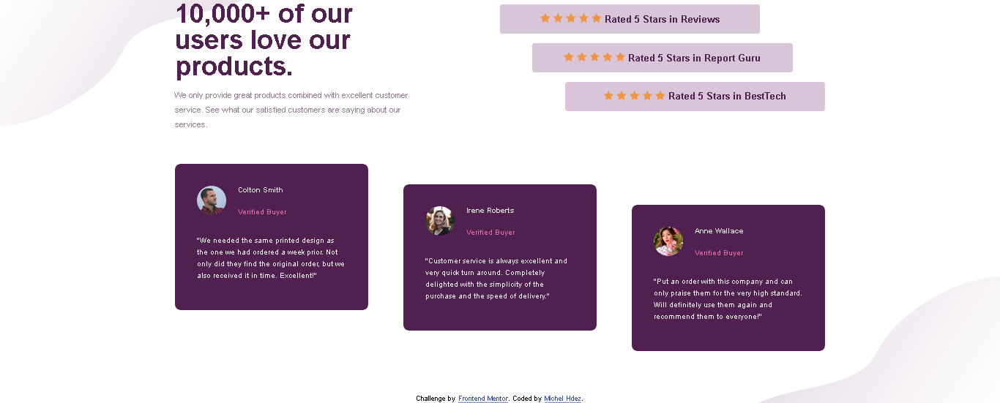

# Frontend Mentor - Social proof section

> This is a solution to the [Stats preview Social proof section challenge on Frontend Mentor](https://www.frontendmentor.io/challenges/social-proof-section-6e0qTv_bA).
Frontend Mentor challenges help you improve your coding skills by building realistic projects.

## Table of contents

- [Overview](#overview)
  - [The challenge](#the-challenge)
  - [Screenshot](#screenshot)
  - [Links](#links)
- [My process](#my-process)
  - [Built with](#built-with)
- [Author](#author)

## Overview

### The challenge

Users should be able to:

- View the optimal layout depending on their device's screen size 
- Get it looking as close to the design as possible

### Screenshot

### Links

- Solution URL: [Repository]()

### Built with

- Semantic HTML5 markup
- CSS custom properties
- Flexbox
- CSS Grid

## Author️✒️

- Github - [profile](https://github.com/MichelHdez)
- Frontend Mentor - [@MichelHdez](https://www.frontendmentor.io/profile/MichelHdez)